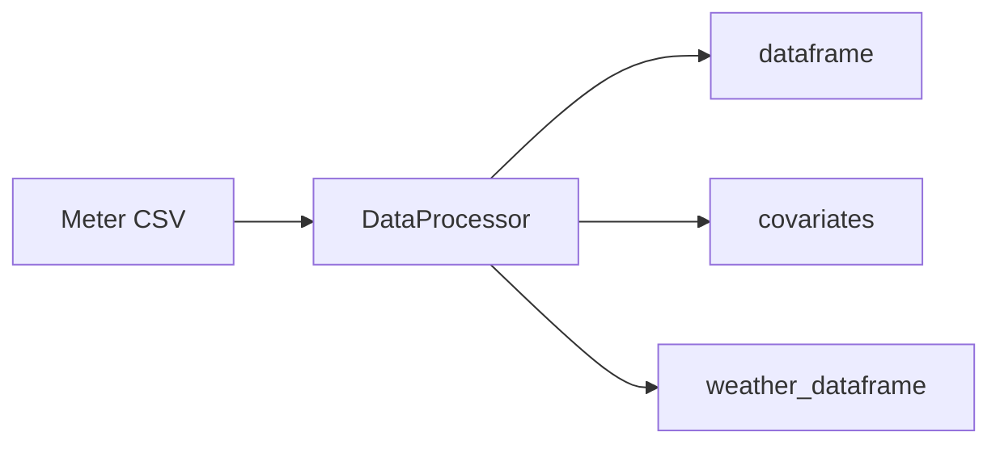

# Data processing

`DataProcessor` loads hourly meter CSVs, slices them to a date range, optionally builds **virtual meters**, constructs **calendar covariates**, and can fetch **hourly temperature** from the Open-Meteo API.

## Role in the pipeline

Data processing is usually the **first step**: it produces the meter `dataframe`, optional `covariates`, and optional `weather_dataframe` that downstream cleaning, EDA, and modeling consume.



## CSV expectations

- Index column name: **`Date / Time`** (parsed as datetimes).
- One or more numeric meter columns.
- `start_date` and `end_date` are inclusive bounds (`YYYY-MM-DD`).

## Constructor parameters

| Parameter | Description |
|-----------|-------------|
| `file_path` | Path to the meter CSV. |
| `start_date`, `end_date` | Date strings bounding the slice. |
| `addmeter` | Optional `dict` mapping new meter names to lists of columns to sum, e.g. `{"Campus": ["BldgA", "BldgB"]}`. |
| `BreaksWeather` | Four booleans `[holidays, summer, InSession, weather]`. Default all `True`. Set the last to `False` to skip weather download. |
| `holiday_dict_path` | Optional path to a custom holiday JSON. If omitted, looks for `HOLIDAYDICT.JSON` / `HOLIDAYDICT.json` beside the CSV, then uses the **packaged** default in `timeries/data/holidaydict.json`. |

## Outputs (instance attributes)

| Attribute | Description |
|-----------|-------------|
| `dataframe` | Meter readings for the requested window (index = hourly timestamps). |
| `covariates` | Hourly feature frame aligned to the same index when calendar features are enabled. |
| `weather_dataframe` | Hourly `Temperature (°F)` when weather is enabled (index aligned to `start_date`). |

## Covariate columns

When enabled via `BreaksWeather`, typical columns include:

| Column | Meaning |
|--------|---------|
| `is_not_weekend` | `1` on weekdays, `0` on Saturday/Sunday. |
| `Holiday_name` | Named break (e.g. Thanksgiving Break) or `No Holiday`. |
| `IsNotHoliday` | `1` when not on a named holiday window. |
| `IsnotSummerBreak` | `1` outside summer break ranges. |
| `InSession` | Product of holiday, weekend, and summer flags (when all three feature groups are on). |

Holiday ranges come from the holiday dictionary (packaged or custom). Summer break uses the `Summer Break` entry in that file.

## Weather

Weather is pulled for coordinates near **Muncie, IN** (latitude 40.2035, longitude -85.4064), timezone `America/Indiana/Indianapolis`:

- **Archive API** when history extends more than ~60 days before “now”.
- **Forecast API** for recent and forward-looking hours.

HTTP responses are cached under `.cache` in the **same directory as the CSV** (not the current working directory).

## Example

```python
from timeries import DataProcessor

proc = DataProcessor(
    file_path="data/meters.csv",
    start_date="2023-01-01",
    end_date="2023-12-31",
    addmeter={"Total": ["Meter_A", "Meter_B"]},
    BreaksWeather=[True, True, True, True],
)

meter_df = proc.dataframe
covariates = proc.covariates
weather = proc.weather_dataframe
```

## Custom holidays

Place `HOLIDAYDICT.json` next to your CSV, or pass `holiday_dict_path="/path/to/holidays.json"`. Each key maps to a flat list of `[start, end, start, end, ...]` date strings per occurrence year.

## API reference

Full constructor and method listing: [`DataProcessor` in the API reference](api.md#timeries.data_processing.DataProcessor).
