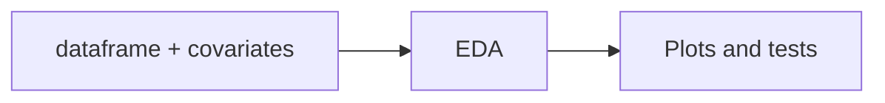

# Exploratory data analysis (EDA)

`EDA` combines meter readings with optional **covariates** and **weather**, then provides plots and statistical summaries tailored to **hourly energy-style** time series.

## Role in the pipeline

Use EDA **after** data is loaded (and optionally cleaned) to understand seasonality, session effects, temperature sensitivity, trend, and autocorrelation before fitting forecasts.



## Constructor parameters

| Parameter | Description |
|-----------|-------------|
| `dataframe` | Meter data; datetime index (timezone stripped if present). |
| `meter` | Target column name for plots and tests. |
| `covariates` | Optional frame joined on the index (e.g. from `DataProcessor.covariates`). Needed for session/holiday plots. |
| `weather` | Optional weather frame (e.g. `DataProcessor.weather_dataframe`). Required for temperature boxplots. |
| `timeframe` | Optional `(start, end)` slice, e.g. `("2023-06-01", "2023-08-31")`. |

## Plotting methods

### `ts_plot`

Time series of the target meter with optional smoothing and calendar shading.

| Argument | Default | Notes |
|----------|---------|-------|
| `smoothing` | `['hp', 200]` | `['ma', window]`, `['hp', lamb]`, or `'None'`. |
| `annotated` | `False` | Shades weekends, holidays, and summer break when covariate columns exist. |

### `plot_seasonal_usage`

Boxplots of usage by **season** and **in session vs not**, using custom season bins (defaults span the academic calendar). Requires an **`InSession`** column (from `DataProcessor` when `BreaksWeather[2]` is enabled).

### `plot_usage_by_temperature_InSession`

Boxplots of usage vs **temperature bins** and session status. Requires `weather` at construction and **`InSession`** in the merged frame.

### `seasonal_decompose`

Wraps `statsmodels.tsa.seasonal.seasonal_decompose` on the target series (`additive` or `multiplicative`, optional `period`).

### `autocorr_plot`

ACF plot for lag structure (default 50 lags); useful for choosing SARIMAX / NeuralProphet lag settings.

## Statistical tests

### `run_trend_tests`

Prints **Mann–Kendall** and **seasonal Mann–Kendall** results (trend direction, p-value, Tau). Default seasonal period is **24** hours.

## Example

```python
from timeries import DataProcessor, EDA

proc = DataProcessor("data/meters.csv", "2023-01-01", "2023-12-31")

analysis = EDA(
    dataframe=proc.dataframe,
    meter="Total",
    covariates=proc.covariates,
    weather=proc.weather_dataframe,
    timeframe=("2023-08-01", "2023-12-31"),
)

analysis.ts_plot(annotated=True)
analysis.plot_seasonal_usage()
analysis.plot_usage_by_temperature_InSession()
analysis.seasonal_decompose(period=24)
analysis.run_trend_tests(seasonal_periods=24)
analysis.autocorr_plot(lags=168)
```

## Covariate columns used by plots

| Column | Used when |
|--------|-----------|
| `is_not_weekend` | `ts_plot(annotated=True)` |
| `Holiday_name`, `IsNotHoliday` | Holiday shading |
| `IsnotSummerBreak` | Summer break shading |
| `InSession` | Seasonal and temperature boxplots |

## API reference

Full listing: [`EDA` in the API reference](api.md#timeries.eda.EDA).
