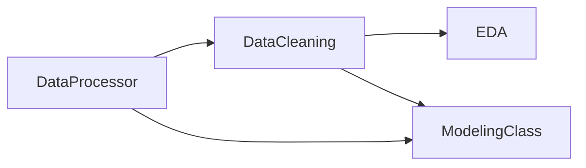

# Timeries

Timeries is a Python library for working with hourly meter-style time series: exploratory plots, outlier handling, CSV ingestion with calendar covariates and weather, and forecasting with **Prophet**, **NeuralProphet**, or **SARIMAX**.

## Typical workflow



1. **[Data processing](data-processing.md)** — load CSV, build covariates and weather.
2. **[Data cleaning](data-cleaning.md)** — detect and replace outliers.
3. **[EDA](eda.md)** — plots, decomposition, trend and ACF analysis.
4. **[Modeling](modeling.md)** — forecast with optional regressors and intervals.
5. **[Chat assistant tools](mcp-tools.md)** — plain-language guide to the MCP tools used by the energy assistant.

## User guide

| Module | Class | Guide |
|--------|-------|-------|
| `timeries.data_processing` | `DataProcessor` | [Data processing](data-processing.md) |
| `timeries.data_cleaning` | `DataCleaning` | [Data cleaning](data-cleaning.md) |
| `timeries.eda` | `EDA` | [EDA](eda.md) |
| `timeries.modeling` | `ModelingClass` | [Modeling](modeling.md) |

The [Chat assistant tools](mcp-tools.md) page explains what non-technical users can ask the assistant to do with live meter data.

## Install

From a clone of this repository:

```bash
pip install -e .
```

With documentation tooling:

```bash
pip install -e ".[docs]"
```

## Quick start

```python
from timeries import DataProcessor, DataCleaning, EDA, ModelingClass

proc = DataProcessor("data/meters.csv", "2023-01-01", "2023-12-31")
clean = DataCleaning(proc.dataframe, meter="YourMeter", method="Hampel")
cleaned = clean.detect_outliers()

EDA(proc.dataframe, "YourMeter", covariates=proc.covariates).ts_plot()

model = ModelingClass(
    cleaned,
    "YourMeter",
    weather=proc.weather_dataframe,
    covariates=proc.covariates,
    features=["InSession"],
    model="Prophet",
    test_hours=168,
)
print(model.assessment())
```

- [Python API](api.md) — library classes and methods (mkdocstrings).

The **REST API** page (Swagger iframe at `http://127.0.0.1:8000/docs`) is included only in the **local** docs build, not on GitHub Pages.

## Local documentation

Python API only (same as the published site):

```bash
mkdocs serve -a 127.0.0.1:8001
```

Python API + REST API (start FastAPI on port 8000 first):

```bash
mkdocs serve -f mkdocs.local.yml -a 127.0.0.1:8001
```

Use port **8001** for MkDocs so it does not conflict with FastAPI on **8000**.

## Published documentation

Docs deploy to GitHub Pages on push to `main`:

`https://<your-github-username>.github.io/Timeries/`
