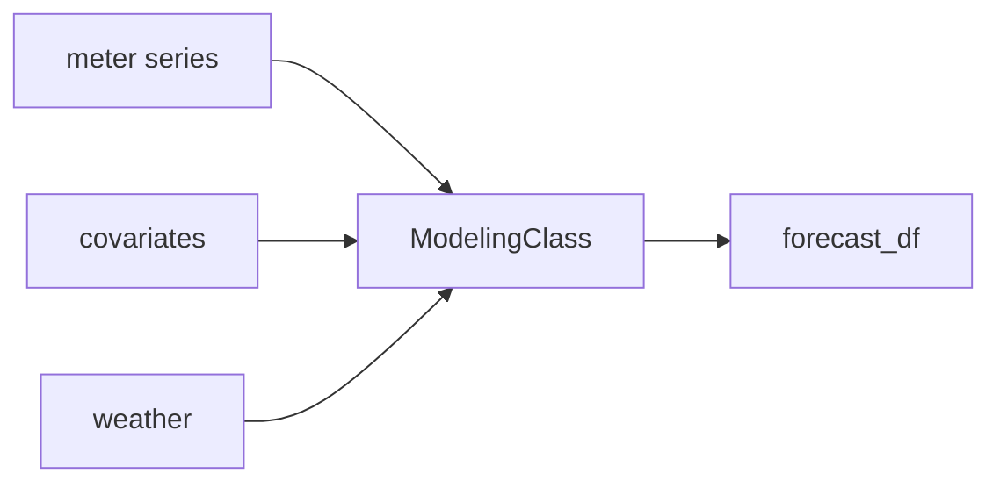

# Modeling and forecasting

`ModelingClass` fits **Prophet**, **NeuralProphet**, or **SARIMAX** on hourly meter data, with optional **weather** and **covariate** regressors, and produces forecasts with configurable **confidence intervals**.

## Role in the pipeline

Modeling is typically the **last step**: pass a cleaned meter `DataFrame` plus aligned `covariates` / `weather` from `DataProcessor`.



## Models

| `model` | Library | Notes |
|---------|---------|-------|
| `'Prophet'` | Facebook Prophet | Weekly/daily seasonality; regressors for features and weather. |
| `'NeuralProphet'` | NeuralProphet | Iterative multi-step forecast loop; `n_lags`, `n_forecasts`; quantile intervals. |
| `'SARIMAX'` | statsmodels | `sarimax_order`, `sarimax_seasonal_order`; weather scaled with `StandardScaler`. |

Fitting runs in **`__init__`**. Results are stored on:

- `forecast_df` — history plus holdout or future forecast columns (`yhat`, interval columns, `y` where observed).
- `fitted_model` — underlying fitted model object.
- `prophet_data` — internal `ds` / `y` (+ regressor) frame from `data_transform()`.

## Train/test vs forecast-only

| Mode | `forecast_only` | `test_hours` meaning |
|------|-----------------|----------------------|
| **Evaluation** | `False` (default) | Hours held out at the **end** for metrics and `plot_test()`. |
| **Production forecast** | `True` | Hours to predict **forward** after the last observation; trains on **all** history. |

When `forecast_only=True`, `covariates` and `weather` must cover **`len(dataframe) + test_hours`** rows so future regressors are available.

## Key parameters

| Parameter | Default | Description |
|-----------|---------|-------------|
| `dataframe`, `meter` | — | Target series (single column retained internally). |
| `covariates`, `features` | `None` | External regressors; `features` is required if `covariates` is passed (str or list of column names). |
| `weather` | `None` | Frame with `Temperature (°F)` aligned by time. |
| `test_hours` | `168` | One week of hours at hourly frequency. |
| `interval_width` | `0.95` | Confidence level (e.g. 95%). |
| `interval_type` | `'two-sided'` | `'two-sided'`, `'upper-bounded'`, or `'lower-bounded'` (affects plots). |
| `n_lags`, `n_forecasts` | `24`, `1` | NeuralProphet only. |
| `sarimax_order` | `(2, 1, 1)` | SARIMAX `(p, d, q)`. |
| `sarimax_seasonal_order` | `(1, 1, 1, 24)` | Seasonal `(P, D, Q, s)` with `s=24` hours. |

## Forecast columns

Typical columns in `forecast_df`:

| Column | Description |
|--------|-------------|
| `ds` | Timestamp |
| `y` | Observed usage (NaN in pure forecast rows) |
| `yhat` | Point forecast |
| `yhat_lower`, `yhat_upper` | Two-sided interval |
| `yhat_upper_ub` | Upper-bounded interval bound |
| `yhat_lower_lb` | Lower-bounded interval bound |

## Evaluation and plots

| Method | When to use |
|--------|-------------|
| `assessment()` | Returns `(rmse, mae, mape)` on the last `test_hours` where `y` and `yhat` exist (`forecast_only=False`). |
| `plot_test()` | Holdout period: forecast vs actual with intervals. |
| `plot_full()` | Historical + **future** forecast (best with `forecast_only=True`). |
| `plot_forecast_only()` | Only the forward forecast segment. |

## Example: backtest

```python
from timeries import DataProcessor, DataCleaning, ModelingClass

proc = DataProcessor("data/meters.csv", "2023-01-01", "2023-12-31")
clean = DataCleaning(proc.dataframe, meter="Total", method="Hampel")
cleaned = clean.detect_outliers()

model = ModelingClass(
    dataframe=cleaned,
    meter="Total",
    weather=proc.weather_dataframe,
    covariates=proc.covariates,
    features=["InSession", "is_not_weekend"],
    model="Prophet",
    test_hours=168,
    forecast_only=False,
)

print(model.assessment())
model.plot_test()
```

## Example: forward forecast

```python
model = ModelingClass(
    dataframe=cleaned,
    meter="Total",
    weather=proc.weather_dataframe,
    covariates=proc.covariates,
    features=["InSession"],
    model="NeuralProphet",
    test_hours=336,
    forecast_only=True,
    n_lags=24,
    n_forecasts=1,
)

model.plot_full()
model.plot_forecast_only()
```

## API reference

Full listing: [`ModelingClass` in the API reference](api.md#timeries.modeling.ModelingClass).
